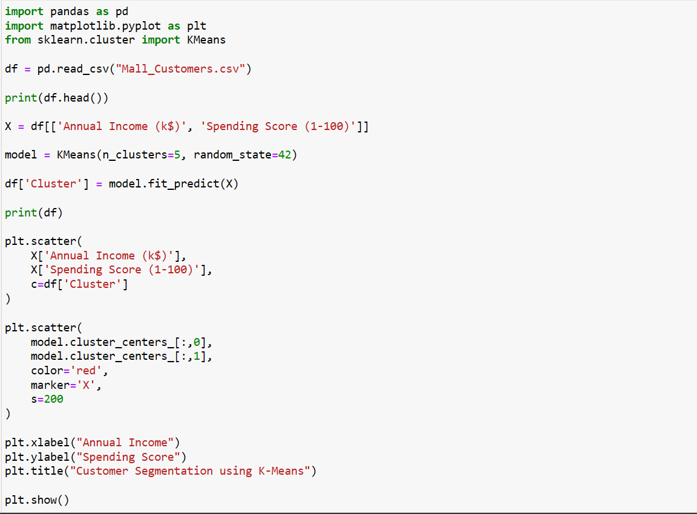
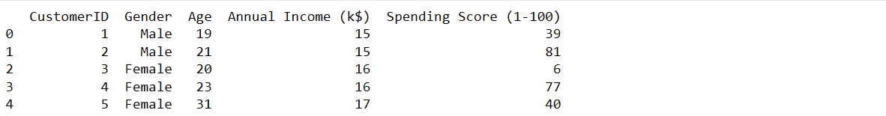
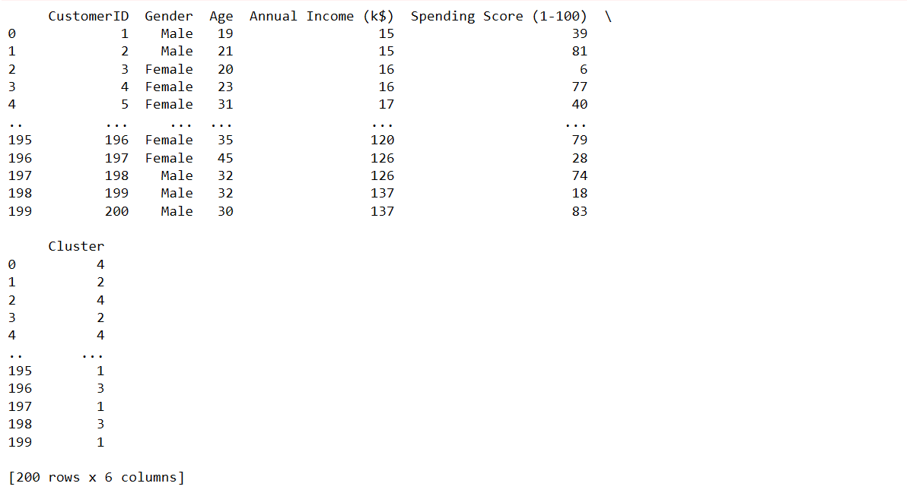
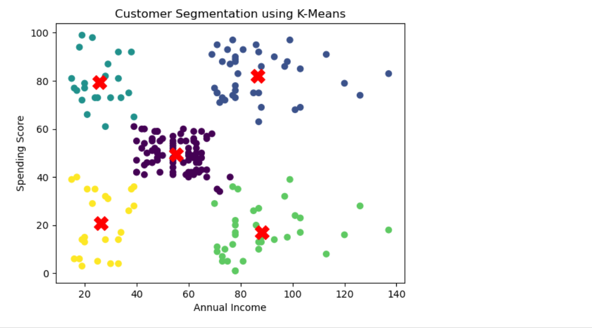

# Implementation-of-K-Means-Clustering-for-Customer-Segmentation

## AIM:
To write a program to implement the K Means Clustering for Customer Segmentation.

## Equipments Required:
1. Hardware – PCs
2. Anaconda – Python 3.7 Installation / Jupyter notebook

## Algorithm

1.Import Libraries and Load Dataset Import required Python libraries and read the customer dataset using pandas.

2.Select Required Features Choose the columns Annual Income and Spending Score for clustering.

3.Apply K-Means Clustering Create the K-Means model with 5 clusters and fit it to the selected data.

4.Predict Customer Clusters Assign each customer to a cluster using the trained K-Means model.

5.Visualize the Clusters Plot the customer groups and centroids using a scatter plot with labels and title.

## Program:
```
/*
Program to implement the K Means Clustering for Customer Segmentation.

import pandas as pd
import matplotlib.pyplot as plt
from sklearn.cluster import KMeans

df = pd.read_csv("Mall_Customers.csv")

print(df.head())

X = df[['Annual Income (k$)', 'Spending Score (1-100)']]

model = KMeans(n_clusters=5, random_state=42)

df['Cluster'] = model.fit_predict(X)

print(df)

plt.scatter(
    X['Annual Income (k$)'],
    X['Spending Score (1-100)'],
    c=df['Cluster']
)

plt.scatter(
    model.cluster_centers_[:,0],
    model.cluster_centers_[:,1],
    color='red',
    marker='X',
    s=200
)

plt.xlabel("Annual Income")
plt.ylabel("Spending Score")
plt.title("Customer Segmentation using K-Means")

plt.show()

Developed by: Swathi P N
RegisterNumber:  212225232079
*/
```

## Output:









## Result:
Thus the program to implement the K Means Clustering for Customer Segmentation is written and verified using python programming.
